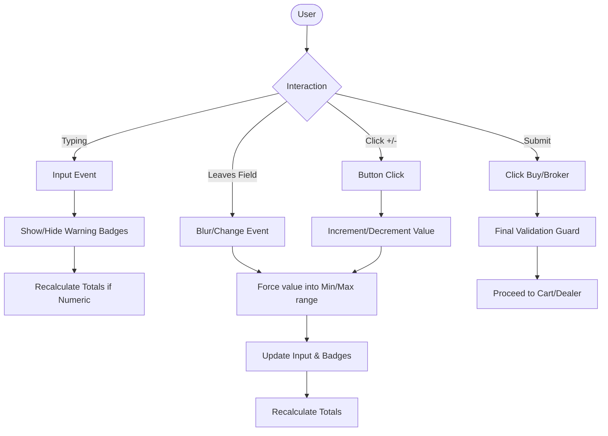

# CHANGE ITEM: 1.01 Supplier Stock Level Capping Logic

## Overview
This feature introduces deterministic logic to cap the maximum order quantity based on the available stock level when specific supplier conditions are met. This ensures that users cannot order more items than currently held in stock if an external supplier is no longer actively selling a product for the direct delivery (DG) market.

## Requirements
1. The script must check three elements on the DOM:
   - Supplier Active Sell (`#supplier-isactivesell`)
   - Market (`#market`)
   - Stock Level (`#stock-level`)
2. If the supplier's active sell value equates to "N" and the market equates to "dg" (both evaluated case-insensitively), the maximum value allowed in the quantity selector must be strictly limited to the numerical value within `#stock-level`.
3. If the currently predefined maximum quantity (`#max-quantity-value`) is greater than the available stock level, or is undefined, it must be programmatically updated to match the stock level.

## Implementation Details
The `buy-gold-details/body/quantity-manager.js` script manages the bounds of the quantity selector input (`#quantity`). It initializes the maximum quantity limit by reading the `#max-quantity-value` element upon `DOMContentLoaded`. 

To seamlessly enforce the stock limit without breaking or bypassing any downstream validation, the new capping logic will be implemented as an interceptor precisely at the start of the `DOMContentLoaded` execution context, prior to any event listeners or input max attribute settings. By mutating the text content of `#max-quantity-value` early, the rest of `quantity-manager.js` will inherently absorb the capped value as the new native `max`.

**Exact Logic Flow:**
1.  **Element Selection:** Attempt to retrieve elements `#supplier-isactivesell`, `#market`, and `#stock-level`. Use `document.getElementById()`.
2.  **Condition Evaluation:** 
    - Extract text from `#supplier-isactivesell`, trim whitespace, and convert to uppercase. Verify if it strictly equals `"N"`.
    - Extract text from `#market`, trim whitespace, and convert to lowercase. Verify if it strictly equals `"dg"`.
    - Parse the text content of `#stock-level` to an integer base 10 (`stockLevel`).
    - Parse the text content of `#max-quantity-value` to an integer base 10 (`currentMax`).
3.  **Application:** 
    - If both conditions (`isSupplierActiveN` and `isMarketDg`) are evaluated to `true`, and `stockLevel` is a valid number (`!isNaN`), evaluate the capping necessity.
    - If `currentMax` is Not-a-Number (NaN) or if `stockLevel < currentMax`, programmatically assign `maxQtyEl.textContent = stockLevel.toString()`.
4. **Execution Positioning:** This snippet will sit exactly inside `quantity-manager.js`, immediately after verifying `qtyInput` exists and displaying it, but before it starts reading `minQtyEl` and `maxQtyEl` to set the DOM element attributes `min` and `max`.

## Impact Assessment

### Impact on other scripts
- **No adverse impacts on existing scripts.** Because we are merely adjusting the `textContent` of the `#max-quantity-value` element before the existing logic in `quantity-manager.js` consumes it, all existing functions (`enforceQtyLimits`, `recalcTotals`, warning badge creators) will behave normally. They will simply compute their limits against the new, lower threshold.
- Other scripts interacting with the cart or quote data read the actual value of `#quantity`, which is clamped securely by `quantity-manager.js`. Thus, downstream payload generation scripts (like `quote-data-transfer.js` or `order-data-transfer.js`) will naturally receive the correctly clamped quantity.

### Impact on UI/UX
- The UI will natively reflect the capped limit. The visual badge rendering `max: [value]` will automatically display the newly capped stock limit instead of the generic maximum order limit, informing the user correctly.
- If a user tries to type a number higher than the stock level, the existing `enforceQtyLimits` will forcefully correct their input down to the available stock limit, triggering the maximum boundary warning message.

## Code Blueprint

### Modified Section in `buy-gold-details/body/quantity-manager.js`
```javascript
  /* ------------------------------------------------------------------
     Init
  ------------------------------------------------------------------ */
  document.addEventListener("DOMContentLoaded", () => {
    if (!qtyInput) return;

    /* inject style for the badges once */
    if (!document.getElementById("qty-limits-style")) {
      const style = document.createElement("style");
      style.id = "qty-limits-style";
      style.textContent = \`
        .min-qty-message,
        .max-qty-message {
          margin-left: 5px;
          font-size: 0.875rem;
          line-height: 1;
          vertical-align: middle;
          color: #c00; /* red */
        }
      \`;
      document.head.appendChild(style);
    }

    qtyInput.style.display = "inline-block";

    // --- NEW: DG Supplier Stock Level Capping Logic ---
    // If supplier is not actively selling (N) and market is DG, we cannot order more than what we have on hand.
    // We cap the max order display value here so the rest of the script automatically enforces it.
    const supplierIsActiveSellEl = document.getElementById("supplier-isactivesell");
    const marketEl = document.getElementById("market");
    const stockLevelEl = document.getElementById("stock-level");

    if (maxQtyEl && supplierIsActiveSellEl && marketEl && stockLevelEl) {
      const isSupplierActiveN = supplierIsActiveSellEl.textContent.trim().toUpperCase() === "N";
      const isMarketDg = marketEl.textContent.trim().toLowerCase() === "dg";
      
      if (isSupplierActiveN && isMarketDg) {
        const stockLevel = parseInt(stockLevelEl.textContent.trim(), 10);
        const currentMax = parseInt(maxQtyEl.textContent.trim(), 10);
        
        if (!isNaN(stockLevel)) {
           // Cap the max quantity text content if stock level is lower or current max is invalid
           if (isNaN(currentMax) || stockLevel < currentMax) {
               maxQtyEl.textContent = stockLevel.toString();
           }
        }
      }
    }
    // ---------------------------------------------------

    // ensure starting value meets minimum
    // ... [existing initialization code continues] ...

---

# 2026-03-16: Quantity Input Mobile UX Improvement

## Overview
This update addresses a critical usability issue on mobile devices where aggressive quantity clamping prevents manual entry of numbers (e.g., entering '15' when '5' is the minimum). It also adds custom increment/decrement controls to improve the experience on platforms where native input arrows are hidden.

## Requirements
1.  **Soft Validation:** During active typing (`input` event), the UI must show warning badges if the value is out of range, but must NOT overwrite the user's input.
2.  **Hard Clamping:** Enforce the minimum and maximum bounds only when the user leaves the field (`blur`), completes a change (`change`), or uses the increment/decrement buttons.
3.  **Custom Controls:** Programmatically inject '+' and '-' buttons next to the quantity input for easier mobile interaction. Supports "hold-to-repeat" for rapid incrementing/decrementing.
4.  **Submission Guard:** Ensure that any submission (Add to Cart / Broker) performs a final range check before proceeding.

## Implementation Details

### 1. `quantity-manager.js` Refactor
- Split the current `enforceQtyLimits` logic into:
    - `updateWarnings()`: Visual feedback only.
    - `clampToRange()`: Value enforcement.
- Bind `updateWarnings()` to the `input` event.
- Bind `clampToRange()` to `blur` and `change`.
- Inject custom button elements with appropriate CSS for a tap-friendly interface.
- **Hold-to-Repeat:** Implemented `mousedown`/`touchstart` timers that trigger rapid value changes if the button is held down for more than 500ms.

### 2. Submission Logic
- Update `broker-data-transfer.js` to include a final `clampToRange` call or equivalent logic before processing the quantity for the URL payload.

## Proposed Workflow


## Detailed Phasing

### Phase 1: Logic Separation
- Refactor `enforceQtyLimits` to support "Soft" (warning-only) and "Hard" (clamping) modes.
- Update `recalcTotals` to handle empty/invalid strings gracefully by either showing a placeholder or using the previous valid value.

### Phase 2: UI Injection
- Create a container around the quantity input.
- Inject stylized `-` and `+` buttons.
- Add CSS to ensure buttons are large enough for mobile touch targets (minimum 44x44px).

### Phase 3: Event Binding & Integration
- Update all event listeners to use the appropriate validation mode.
- Integrate the buttons with the new logic.

### Phase 4: Downstream Validation
- Add a helper function to `broker-data-transfer.js` (and any other relevant scripts) that ensures the input value is valid before the data is serialized for the next step.

## Impact Assessment
- **Existing Logic:** The "DG Supplier Stock Level Capping Logic" remains the source of truth for the maximum value.
- **UX:** Mobile users can now delete and type any number; if it's invalid upon leaving the field, it will be corrected to the nearest bound.
- **Totals:** Calculations will wait for a valid number or use a fallback during partial entry.


=============================================


# CHANGE ITEM 1.02: Proposal: Quantity Input Management Redesign


## 1. Problem Statement
The current implementation of the quantity input manager in `buy-gold-details/body/quantity-manager.js` uses an aggressive "clamping" approach on the `input` event. 

**Issues Identified:**
- **Blocking Input on Mobile:** If a minimum quantity is set (e.g., 5), a user cannot delete the '5' and type '1' to begin entering '15'. The script immediately detects that '1' (or an empty string) is less than the minimum and resets the value back to '5'.
- **Poor Mobile UX:** Native HTML5 number input increment/decrement arrows are often hidden or difficult to use on mobile browsers. Users are forced to rely on keyboard entry, which is hindered by the aggressive clamping described above.
- **Inconsistent Validation:** While the UI prevents "illegal" inputs, it doesn't provide a secondary check at the point of submission (Add to Cart / Live Quote), relying entirely on the state of the input field.

## 2. Proposed Solution

### A. "Soft" Validation vs. "Hard" Clamping
We will split the validation logic into two distinct phases:

1.  **Immediate Feedback (Soft):** Triggered on `input`. The script will update the red warning badges (`min: X`, `max: Y`) but will **not** modify the user's input. This allows the user to transition through invalid states (like an empty field or a partial number) while typing.
2.  **Enforced Range (Hard):** Triggered on `blur` (leaving the field), `change` (completing an entry), or when using the new UI buttons. This is where the value will be "clamped" to the nearest valid bound.

### B. Custom Mobile-Friendly Controls
We will programmatically inject stylized "Minus" (`-`) and "Plus" (`+`) buttons next to the quantity input. 

**Design Specifications:**
- **Visuals:** Large, tap-friendly buttons with a neutral style that fits the existing site design.
- **Behavior:** Clicking `-` will decrement the quantity by 1 (respecting `min`). Clicking `+` will increment by 1 (respecting `max`).
- **Integration:** These buttons will trigger the "Hard" clamping and update the total price immediately.

### C. Submission Safeguard
A final validation check will be added to the submission event (e.g., clicking the "Broker" or "Add to Cart" button). If the field contains an invalid value at that moment, it will be clamped to the nearest valid bound before the transaction proceeds.

## 3. Detailed Implementation Plan

### Phase 1: `quantity-manager.js` Refactor
1.  **Introduce UI Buttons:**
    - Create a wrapper for the quantity input.
    - Inject `<button type="button" class="qty-btn-minus">-</button>` and `<button type="button" class="qty-btn-plus">+</button>`.
    - Add CSS for these buttons via the existing style injection block.

2.  **Refactor Logic:**
    - `updateWarnings(val)`: Handles showing/hiding the `min-qty-message` and `max-qty-message` based on the current value.
    - `clampValue(val)`: Returns the value clamped between `min` and `max`.
    - `handleInput()`: Calls `updateWarnings()` and `recalcTotals()` (with fallback for invalid numbers).
    - `handleBlur()`: Calls `clampValue()`, updates the input field, and refreshes warnings/totals.

3.  **Update Event Listeners:**
    - `input` -> `handleInput`
    - `blur`, `change` -> `handleBlur`
    - `plusButton.click` -> Increment, then `handleBlur`
    - `minusButton.click` -> Decrement, then `handleBlur`

### Phase 2: Submission Logic Update
1.  **Update `broker-data-transfer.js`:**
    - Before gathering URL parameters, perform a final `parseInt` and range check on the quantity input.

## 4. Mermaid Workflow Diagram



## 5. Impact Assessment
- **Stock Capping:** The existing "DG Supplier Stock Level Capping Logic" will continue to work perfectly, as it modifies the `#max-quantity-value` source element. The new `clampValue` function will simply use the updated text content of that element.
- **Pricing:** `recalcTotals` will be updated to handle non-numeric input gracefully (e.g., by not updating or showing '---') until a valid number is present.
- **Accessibility:** Buttons will be correctly typed as `button` (not `submit`) to prevent form submission issues, and will include appropriate aria-labels if possible.
